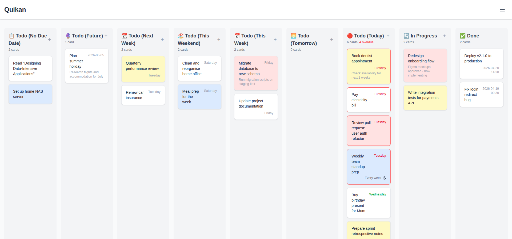

# Quikan

A web-based Kanban board that uses iCalendar (a.k.a. VTODO/iCal) files as a storage mechanism. Works will with other tools like [todoman](https://github.com/pimutils/todoman) and [vdirsyncer](https://github.com/pimutils/vdirsyncer).



## Features

- **VTODO Backend**: Each task is stored as a separate `.ics` file using the VTODO format
- **Smart Kanban Columns**: The *Todo* column dynamically splits into contextual sub-columns based on the current day of the week (Today, Tomorrow, This Week, This Weekend, Next Week, Future, etc.)
- **Drag & Drop**: Move tasks between columns with a drag-and-drop interface
- **Due Dates**: Optional due dates with or without a time component, colour-coded by urgency
- **Recurring Tasks**: Full RFC 5545 RRULE support with a visual recurrence editor (daily, weekly, monthly, yearly; with end-by-date or end-by-count options)
- **vdirsyncer / CalDAV Compatible**: The data directory can be synced with CalDAV servers using tools like vdirsyncer, and tasks completed by external tools (todoman, Apple iOS Reminders) are displayed correctly
- **Dockerized**: Ready to deploy with Docker and docker-compose

## Quick Start

### Using Docker

1. Clone the repository:

```bash
git clone https://github.com/andrewferrier/quikan.git
cd quikan
```

1. Start with docker-compose:

```bash
docker-compose up
```

1. Open your browser at `http://localhost:4000`

### Self-Hosting from Source

#### Prerequisites

- Node.js 20 or higher
- npm

#### Setup

1. Clone the repository:

```bash
git clone https://github.com/andrewferrier/quikan.git
cd quikan
```

1. Install dependencies:

```bash
npm install
```

1. Build:

```bash
npm run build
```

1. Start the server:

```bash
npm start
```

The application will be available at `http://localhost:4000`.

## Configuration

| Variable      | Default                      | Description                                              |
| ------------- | ---------------------------- | -------------------------------------------------------- |
| `QUIKAN_DATA` | `data/` (next to the server) | Path to the directory where `.ics` card files are stored |
| `PORT`        | `4000`                       | Port the server listens on                               |

## Compatibility Notes

Quikan stores recurring tasks using a "standalone clone" model compatible with `vdirsyncer`, `todoman`, and Apple iOS. When you complete a recurring task, Quikan creates an independent completed copy with a new UID and advances the master to its next occurrence - it does not use RFC 5545's `RECURRENCE-ID` parent/child mechanism, which is poorly supported by sync tools.

**Important:** If your data directory contains any `.ics` files with a `RECURRENCE-ID` property (e.g. synced from another app that uses the parent/child model), Quikan will display an error and refuse to load until those files are removed or migrated. Each `.ics` file must also contain exactly one `VTODO` component.

## Author

Andrew Ferrier
